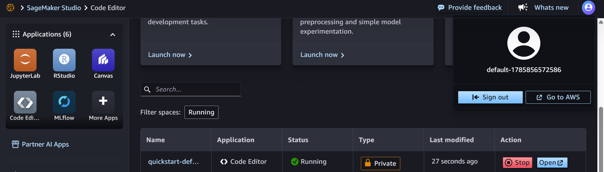
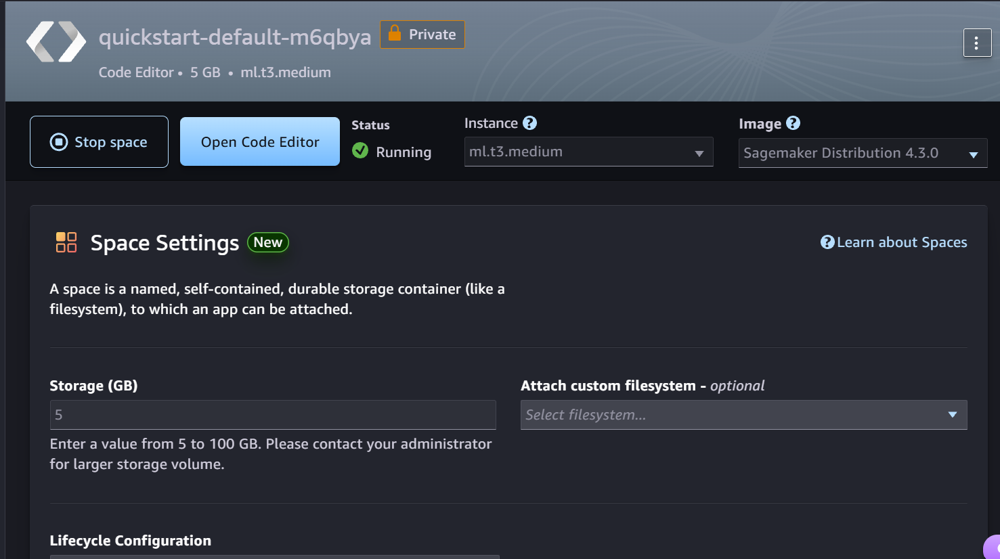
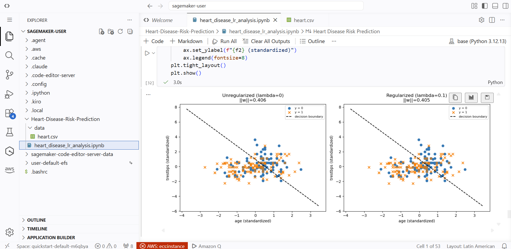
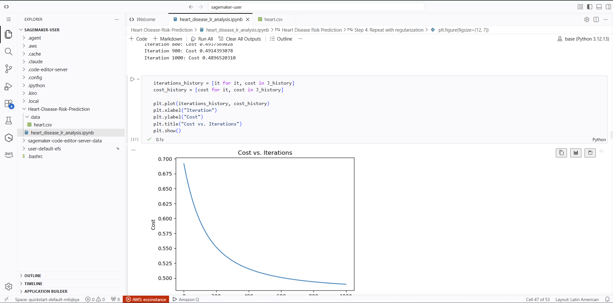
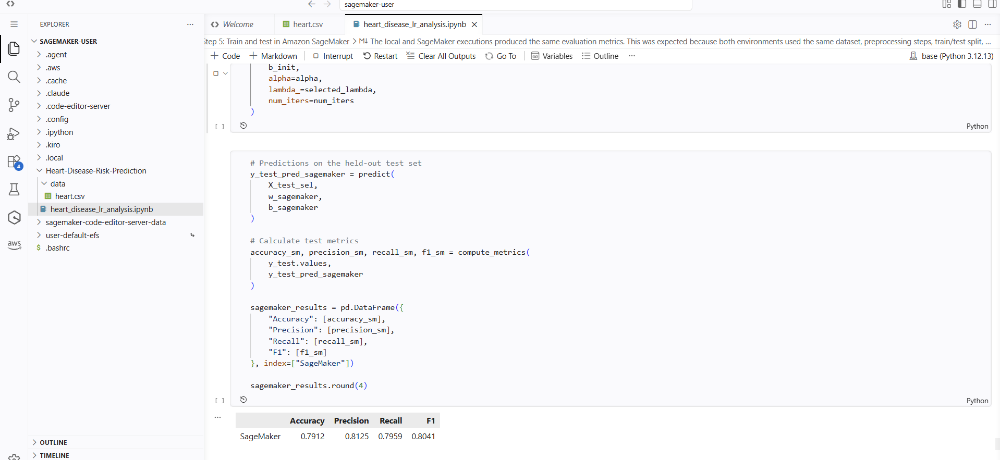
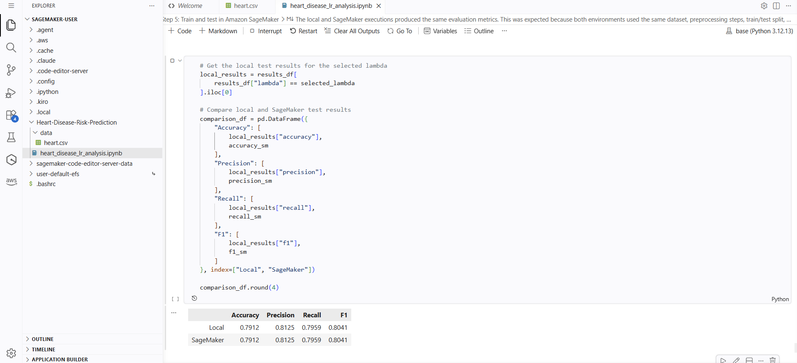

# Heart Disease Risk Prediction

## Exercise Summary

This project implements logistic regression from scratch to predict the presence of heart disease using patient clinical information.

The main goal of the exercise was to understand how logistic regression works instead of using a ready-made model from a machine learning library. For this reason, the sigmoid function, cost function, gradient calculation, gradient descent, prediction function, and L2 regularization were implemented manually using NumPy.

The project includes:

- Exploratory data analysis and data preprocessing.
- Analysis of missing values, duplicated records, outliers, and class distribution.
- A stratified 70/30 train-test split.
- Standardization of the selected features.
- Logistic regression training using gradient descent.
- Evaluation using accuracy, precision, recall, and F1 score.
- Visualization of decision boundaries using different pairs of features.
- L2 regularization and comparison of different lambda values.
- Selection of a final regularized model.
- Training and testing of the final model in Amazon SageMaker.
- Comparison between the local and SageMaker results.

## Dataset Description

The project uses the Heart Disease Dataset available on Kaggle:

[https://www.kaggle.com/datasets/johnsmith88/heart-disease-dataset](https://www.kaggle.com/datasets/johnsmith88/heart-disease-dataset)

The dataset contains clinical information about patients that can be used to study the presence or absence of heart disease.

For this project, the target was converted into a binary variable:

- `0`: absence of heart disease
- `1`: presence of heart disease

After the exploratory analysis, six main features were selected for the logistic regression model:

- `age`: age of the patient
- `chol`: serum cholesterol
- `trestbps`: resting blood pressure
- `thalach`: maximum heart rate achieved
- `oldpeak`: ST depression induced by exercise relative to rest
- `ca`: number of major vessels

Before training, the dataset was divided into 70% training data and 30% test data using a stratified split. The numerical features were also standardized using the mean and standard deviation calculated only from the training data.

## Logistic Regression

The logistic regression model was implemented manually instead of using `LogisticRegression` from scikit-learn.

The implementation includes:

- Sigmoid function
- Binary cross-entropy cost
- Gradient computation
- Gradient descent
- Prediction using a threshold of 0.5
- Accuracy, precision, recall, and F1 calculation

Different pairs of features were also used to visualize the decision boundaries and observe how well two variables alone could separate patients with and without heart disease.

The analysis showed that none of the selected pairs produced a perfect linear separation. Among the evaluated pairs, `oldpeak` and `ca` showed the clearest separation.

## L2 Regularization

L2 regularization was added to the logistic regression model to reduce the magnitude of the model coefficients.

The following lambda values were evaluated:

`0, 0.001, 0.01, 0.1, 1`

The classification metrics remained unchanged for lambda values from 0 to 0.1, while the norm of the model weights decreased slightly as lambda increased. With lambda = 1, the regularization effect became stronger, but accuracy, precision, and F1 decreased slightly.

For this reason, `lambda = 0.1` was selected as the final regularization value. It provided a good balance by reducing the magnitude of the model coefficients while maintaining the same test classification performance as the unregularized model.

## Amazon SageMaker

The final model was also trained and tested using Amazon SageMaker through the AWS Academy environment.

The same dataset, preprocessing procedure, train-test split, model implementation, initialization, and hyperparameters used locally were used again in SageMaker.

The final configuration was:

- Learning rate: `0.01`
- Iterations: `1000`
- Lambda: `0.1`
- Classification threshold: `0.5`

The model was initialized and trained again inside the SageMaker JupyterLab environment using the training set. After training, it was evaluated using the same held-out test set used in the local experiment.

No endpoint or deployment service was created because SageMaker was used only for training and testing, as required for this exercise.

## SageMaker Evidence

### 1. SageMaker Environment

The project notebook was uploaded and executed in the Amazon SageMaker JupyterLab environment provided by AWS Academy. The notebook used the `base` kernel with Python 3.12.13.

SageMaker was used only for model training and testing. No endpoint or deployment service was created.

### 2. Model Training

The final regularized logistic regression model was trained again inside SageMaker using gradient descent with 1,000 iterations and lambda = 0.1.

The training process completed successfully and the cost decreased during the iterations.

### 3. Test Results

After training, the model was tested using the held-out test set. This data was not used during the model training process.

The SageMaker results were:

| Metric | Result |
|---|---:|
| Accuracy | 0.7912 |
| Precision | 0.8125 |
| Recall | 0.7959 |
| F1 Score | 0.8041 |

## Local vs SageMaker Results

The final model was executed locally and in SageMaker using the same data preparation, train-test split, initialization, and model configuration.

| Environment | Accuracy | Precision | Recall | F1 |
|---|---:|---:|---:|---:|
| Local | 0.7912 | 0.8125 | 0.7959 | 0.8041 |
| SageMaker | 0.7912 | 0.8125 | 0.7959 | 0.8041 |

Both environments produced the same test results. This was expected because the same data, preprocessing steps, train-test split, model implementation, initialization, and hyperparameters were used.

This also shows that the implementation can reproduce the same training and testing results in the SageMaker environment.

